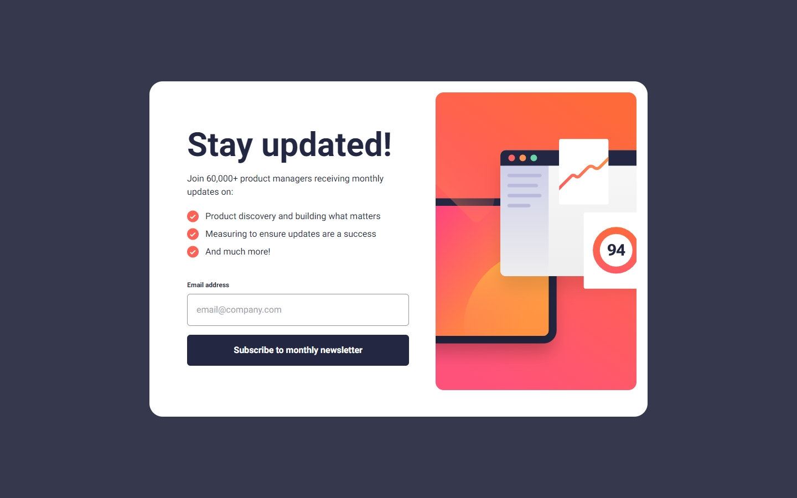
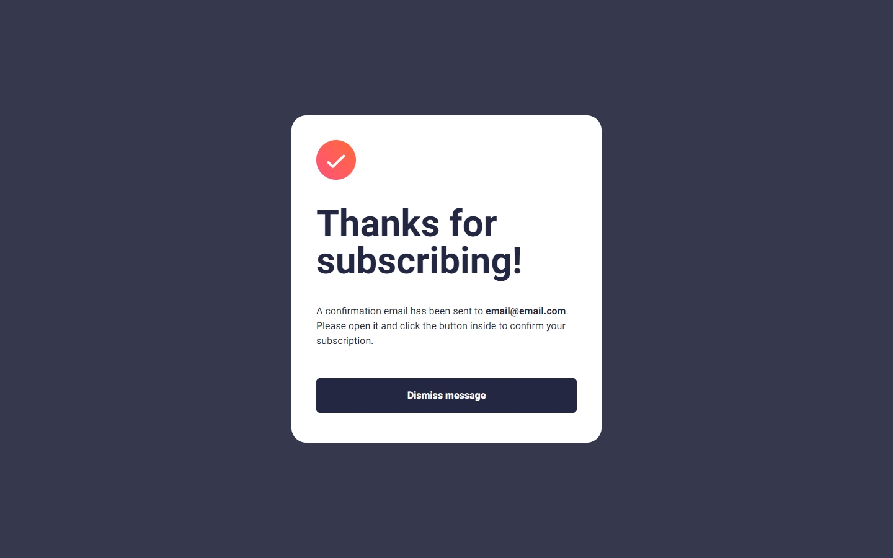
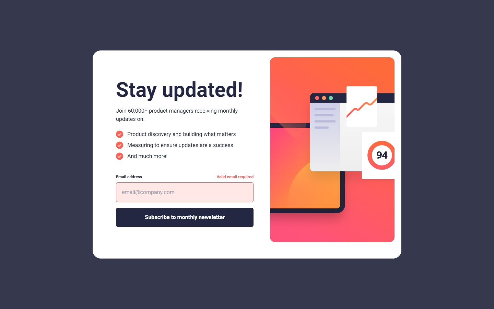
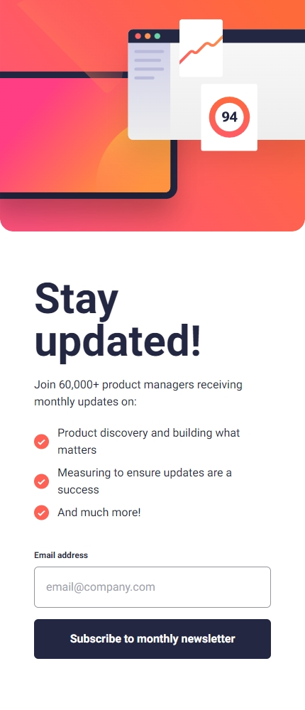
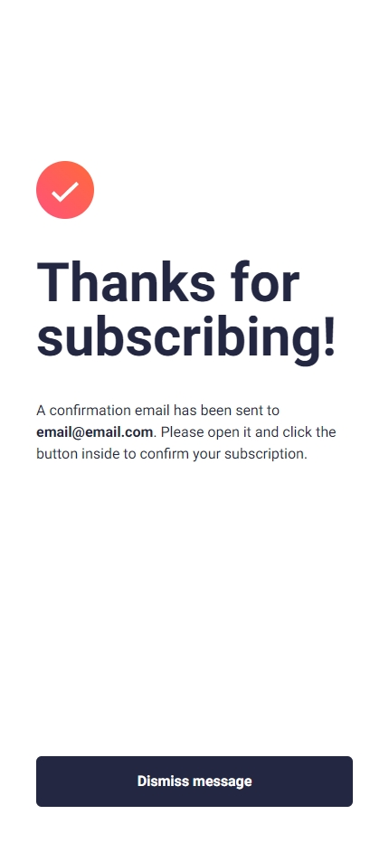

# Frontend Mentor - Newsletter sign-up form with success message solution

This is a solution to the [Newsletter sign-up form with success message challenge on Frontend Mentor](https://www.frontendmentor.io/challenges/newsletter-signup-form-with-success-message-3FC1AZbNrv). Frontend Mentor challenges help you improve your coding skills by building realistic projects.

## Overview

### Screenshot

### Links

- Solution URL: [GirHub](https://github.com/JoelJohs/frontend-mentor_newsletter-sign-up-with-success-message)
- Live Site URL: [GitHub Pages](/a)

## My process

### Built with

- Flexbox
- React
- Vite
- Taildwind

## Author

- freeCodeCamp - [@JoelJohs](https://www.freecodecamp.org/JoelJohs)
- Frontend Mentor - [@JoelJohs](https://www.frontendmentor.io/profile/JoelJohs)
- GitHub - [JoelJohs](https://github.com/JoelJohs)
